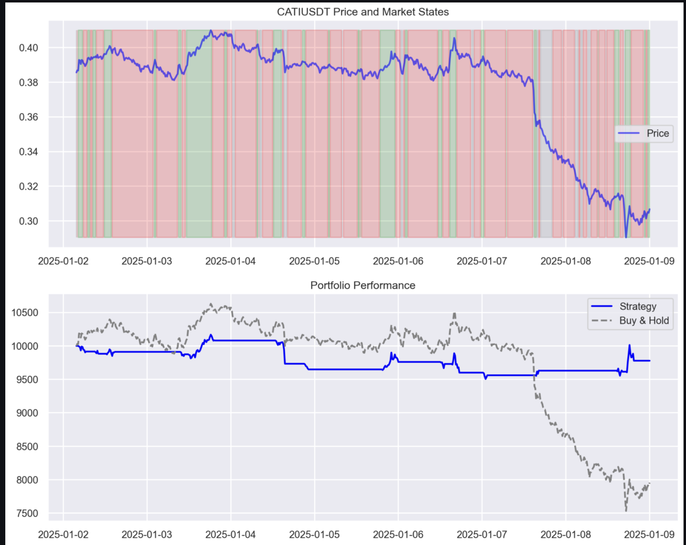

# vela crypto: hmm market regime detection

## overview
a trading model for newly listed crypto assets using hidden markov models (hmm) with baum-welch algorithm. detects market regimes early and trades based on state transitions.

## quick start
```bash
git clone git@github.com:0xDVC/vela-crypto.git
cd vela-crypto
python3 -m poetry shell # need poetry? python3 -m pip install poetry
python3 -m poetry install
streamlit run app.py
```

## dependencies
```toml
python = "^3.11"
pandas = "2.1.4"  # very important
scikit-learn = "^1.6.0"
python-binance = "^1.0.27"
hmmlearn = "^0.3.3"
streamlit = "^1.41.1"
tqdm = "^4.67.1"
joblib = "^1.4.2"
matplotlib = "^3.10.0"
seaborn = "^0.13.2"
requests = "^2.32.3"
ipykernel = "^6.29.5"
plotly = "^5.24.1"
numpy = "1.26.4"    # very important, otherwise you'll run into convergence issues with the model
```

## how it works

### data pipeline
- fetches 15m candles from binance api (rate-limited)
- 97 days of historical data (90 training, 7 testing)
- smart caching to avoid api abuse
- market cap data scraped from binance web (api limitation)

### feature engineering
```python
@dataclass
class FeatureConfig():
    """feature configuration for short-term HMM on small caps"""
    FEATURE_COLUMNS: list = ["returns", "rsi", "bb_position", "volatility", "momentum"]
    RSI_PERIOD: int = 10
    BB_PERIOD: int = 15
    BB_STD: float = 1.8
    MOMENTUM_SPAN: int = 3
```

### hmm implementation
- 3 states (bull/bear/neutral) based on market regimes
- state classification using:
  - returns (2x weight)
  - momentum (1.5x weight)
  - rsi (normalized)
  - volatility (bear detection)

### trading strategy
```python
@dataclass
class TradingConfig:
    initial_balance: float = 10000.0
    trading_fee: float = 0.001
    position_size: float = 0.95
    stop_loss_pct: float = 0.05  # 5% stop loss
    trailing_stop_pct: float = 0.07  # 7% trailing stop
```

## how to use
1. run the streamlit app:
```bash
streamlit run app.py
```

1. what you'll get:
- feature correlation matrix
- market state classifications
- trading signals
- performance metrics with charts

## current performance
- sharpe: -0.20 (work in progress)
- max drawdown: -6.66%
- daily vol: 0.20


_model catches regime changes but needs work on neutral states and stop-loss implementation_

## known issues
1. model behavior:
   - regime changes detected with lag
   - parameter sensitivity (work in progress)
   - state classification needs work

2. trading logic:
   - basic position sizing


3. data limitations:
   - no market cap in binance api
   - 15m minimum interval
   - rate limiting challenges

## roadmap
- [x] model improvements:
  - cross-validation for state selection
  - dynamic state classification
  - parameter optimization

- [x] risk management:
  - implement stop-loss
  - smart position sizing


## project structure
```
.
├── README.md
├── app.py
├── core
│   ├── __init__.py
│   ├── collect.py  # data collection
│   ├── features.py # feature engineering
│   ├── model.py    # hmm implementation
│   ├── report.py   # metrics and charts
│   └── trading.py  # trading logic
├── data
├── image.png
├── poetry.lock
├── pyproject.toml
├── requirements.txt
└── vela_crypto_model.ipynb
```

## why these choices?

### data decisions
- 15m intervals: closest to 10m target while working within binance api limitations
- 90/7 day split: enough data to catch market regimes while keeping test set relevant
- small cap focus: more predictable regime changes in lower liquidity markets

### feature selection
```python
@dataclass
class FeatureConfig():
    """feature configuration for short-term HMM on small caps"""
    FEATURE_COLUMNS: list = ["returns", "rsi", "bb_position", "volatility", "momentum"]
    RSI_PERIOD: int = 10  # shorter for small caps
    BB_PERIOD: int = 15   # adapted for volatility
    BB_STD: float = 1.8   # tighter bands for small caps
    MOMENTUM_SPAN: int = 3 # quick momentum detection
```

why these features?
- returns: primary state indicator
- volatility: crucial for bear market detection
- rsi: proven momentum indicator, especially in crypto
- bb_position: catch mean reversion opportunities
- momentum: early trend detection

### hmm architecture
- 3 states: empirically better than 2 (too simple) or 4+ (overfitting)
- feature weights:
  ```python
  # Calculate combined score with more weight on returns and momentum
  state_scores = (
      state_means[:, returns_idx] * 2.0 +  # Double weight on returns
      state_means[:, momentum_idx] * 1.5 +  # 1.5x weight on momentum
      (state_means[:, rsi_idx] - 50) / 50   # Normalized RSI contribution
  )
  ```
- baum-welch: optimal for unsupervised regime detection
- multiple random starts: avoid local optima

### trading parameters
```python
@dataclass
class TradingConfig:
    initial_balance: float = 10000.0
    trading_fee: float = 0.001    # binance standard fee
    position_size: float = 0.65   # high conviction trades
    stop_loss_pct: float = 0.05   # tight stops for small caps
    trailing_stop_pct: float = 0.07  # balance between profits/whipsaws
```

### optimization choices
- aic/bic metrics: prevent overfitting in state selection
- standardscaler: handle different feature scales
- cross-validation: robust parameter selection


## future work
- sentiment analysis for better regime detection
- on-chain data for better risk management
- portfolio management for better performance
- strategy self-adaptation for dynamic market conditions (highly volatile markets like the crypto market and especially low-cap assets require more adaptive strategies, and more so, self-adaptive strategies)